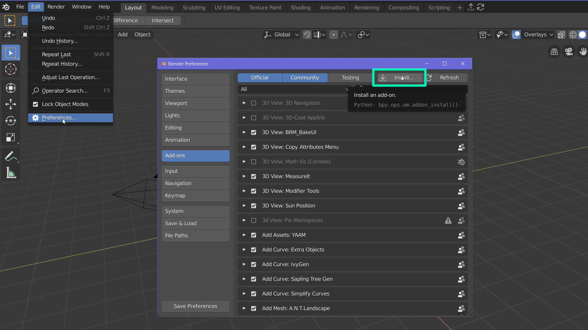
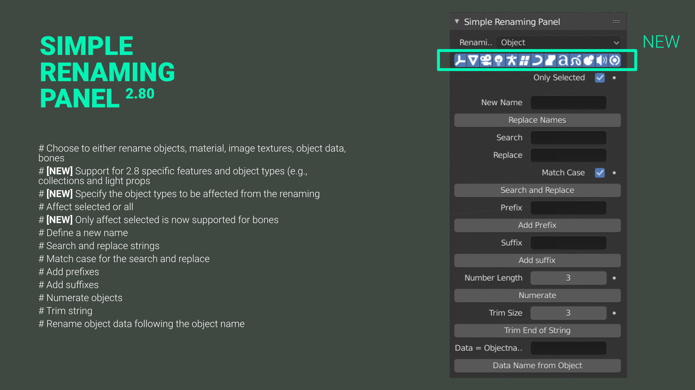
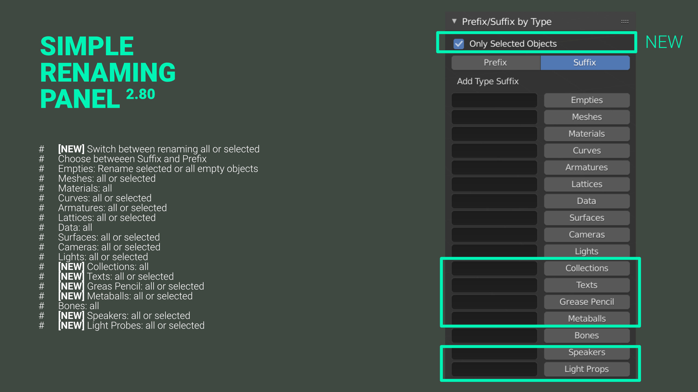
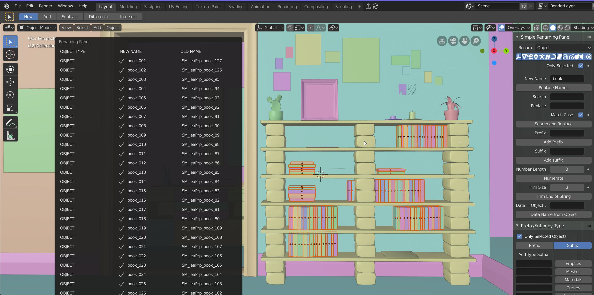

Master is now on Blender 2.80!!!!!

Blender Artists: https://blenderartists.org/forum/showthread.php?408115-Addon-Simple-Renaming-Panel&p=3106784#post3106784 

<h3>Release Notes</h3>

<h4>[1.3.0b] blender 2.80 beta</h4>

<ul>
<li><b>[NEW]</b> UI: The simple renaming panel is now part of the properties panel </li>
<li><b>[NEW]</b> UI: The panel uses for big parts the single column layout </li>
<li><b>[NEW]</b>The codebase was updated to fit the new requironments of blender 2.80 </li>
<li><b>[NEW]</b>The new blender 2.80 specific object types are supported (e.g., grease pencil, lightprops). Groups and Layers have been removed from the addon. </li>
<li><b>[NEW]</b> An option to provide more control over which object type is effected by the renaming action was added. </li>
<li><b>[NEW]</b> It is possible to rename selected bones (Thanks to Cube Creative) </li>	
</ul>

<h4>[1.3.0a] blender 2.80 alpha</h4>

<ul>
<li>[DELETED] Renaming of Collections </li>
<li>[DELETED] Renaming of Render Layers </li>
<li>[DELETED] UI Popup </li>
<li>[CHANGED] Tool panel to Properties panel </li>
<li> [FIXED] This addon can't be installed from the zip file. </li>
</ul>

<h4>[1.2.0]</h4>

<ul>
	<li>[NEW] Renaming works now in different modes: object, material, image texture, group, data and bone </li>
	<li>[NEW] Change the tool shelf category of the add-on in the preferences </li>
	<li>[NEW] Added a match case checkbox has been added to search and replace</li>
	<li>[NEW] A simple and well organized information panel lists which objects have been renamed and includes some additional information </li>
	<li>[NEW] Not only suffixes, but also prefixes can be added by object type</li>
	<li>[CHANGED] Suffix by type has been renamed to type suffix and prefix panel and is now part of the main panel</li>
	<li>[NEW]Surfaces, cameras, lights and bones have been added to the type suffix and prefix panel</li>
	<li>[UPDATED]Auto updater 1.0.3</li>
	<li>[FIX] A lot of minor bugs have been fixed</li>

</ul>

<h4>[1.0.1]</h4>

<ul>
	<li>[New] The posibility to give the objects a new name has been added</li>
</ul>

<h2>Introduction</h2>

<b> Simple Renaming Panel </b> is a small, but really powerful tool to rename more objects at once. The tool includes basic functionalities of adding suffixes, prefixes, search and replace, add suffixes depending on the object type and much more. You decide which kind of objects will be effected by the renaming task, all or just selected objects, should it affect image textures, materials, objects, object data, bones or groups. This tool can be a real everyday helper as renaming multiple objects is needed very often and keeping the naming conventions can be tedious. The tool provides you with a clear feedback of what has been renamed. This tool is kept simple to be user friendly but offers everything you need to stay organized. 

<h4>Key Feature:</h4>

<ul>
	<li>[NEW] Support for light probes and speaker objects </li>
	<li>[NEW] Option to specify object type when renaming objects </li>
	<li>[NEW] Support for blender 2.80 specifc object types (e.g., lightprops, greace pencil)  </li>
	<li>Works for objects, materials, collections, image textures, object data and bones</li>
	<li>Choose if all or just selected objects should be effected </li>
	<li>Search and replace </li>
	<li>Match case option for search and replace</li>
	<li>Add suffixes and prefixes</li>
	<li>Numerate </li>
	<li>Trim names</li>
	<li>Rename object data after object name</li>
	<li>Add suffixes  or prefixes by specific object types </li>
	<li>Simple and clean UI</li>
	<li>Customizable UI position</li>
	<li>Auto updater</li>
</ul>

<h4>Missing in 2.80:</h4>

<ul>
	<li>Customizable UI position<\li>
	<li>Auto updater<\li>
</ul>
		
<h4>Known issues in 2.80:</h4> 
When moving the mouse over the infromation popup a display error occurs sometimes. The popup switches from showing the renamed objects to no object has been renamed.

<h3>Download and Installation</h3>

You can download the Simple Renaming Panel for blender 2.79 and blender 2.80 from the releases section <a href="https://github.com/Weisl/simple_renaming_panel/releases" target="_blank">here</a>.
Like any other Add-on, you can simply install it by going to <b> File &gt; User Preferences &gt; Add-ons </b> and click at the button <b>Install from File </b>. In the new opened window choose the .zip file of the addon and press <b>Install from file </b>.
<b>The Simple Renaming Panel</b> should now appear in your add-ons window and can be activated.

<h4>Simple Renaming Panel</h4>

<ul>
	<li><b>[NEW]</b> Choose which kind of objects you want to rename:</li>
	<li> Changes effect selected or all</li>
	<li> Replace names with a new name</li>
	<li> Search and replace </li>
	<li><b>[NEW]</b> Match case for the search and replace</li>
	<li>Add prefixes </li>
	<li>Add suffixes </li>
	<li>Numerate objects</li>
	<li>Trim string </li>
	<li>Data: Keeping the object data names clear and organized can be really painful in blender, this button simply renames the data according to the objects and adds a specified suffix.</li>
</ul>

<h4>Type Suffix Prefix</h4>

<ul>
	<li><b>[NEW]</b> Choose betweeen Suffix and Prefix</li>
	<li>Geometry: all meshes</li>
	<li>Material: all materials</li>
	<li>Empty:  all empty objects </li>
	<li>Curve: all curves</li>
	<li>Armature: all armatures objects (not bones)</li>
	<li>Group: all groups</li>
	<li>Lattice: all lattices</li>
	<li>Data: all object data</li>
	<li><b>[NEW]</b> Surfaces: all surface objects</li> 
	<li><b>[NEW]</b> Cameras : all cameras </li>
	<li><b>[NEW]</b> Lights: all lights </li>
	<li><b>[NEW]</b> Bones: all bones </li>
</ul>

