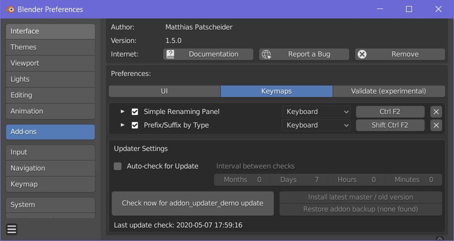

<h1>Introduction</h1>

<b> Simple Renaming Panel </b> is a small, but powerful tool to rename more objects at once. The tool includes basic functionalities of adding suffixes, prefixes, search and replace, add suffixes depending on the object type and much more. Over the time more advanced features like a variable system were added. The tool gives a lot of power to you!  
You decide which kind of objects will be affected by the renaming task. Rename all or just selected objects, specify the affected object types like image textures, materials, objects, object data, bones, or collections. This tool can be a real everyday helper. Renaming multiple objects is often needed and keeping the naming conventions can be tedious. The tool provides you with a clear feedback of what has been renamed. This tool is kept simple to be user friendly but offers everything you need to stay organized. 

<h1>Download and Installation</h1>

You can download the Simple Renaming Panel for blender 2.79 and blender 2.80 from the releases section <a href="https://github.com/Weisl/simple_renaming_panel/releases" target="_blank">here</a>.
Like any other Add-on, you can simply install it by going to <b> File &gt; User Preferences &gt; Add-ons </b> and click at the button <b>Install from File </b>. In the new opened window choose the .zip file of the addon and press <b>Install from file </b>.
<b>The Simple Renaming Panel</b> should now appear in your add-ons window and can be activated.

Once installed, you can use the auto updater in the user preferences to get the latest version of the addon. 

<h1> Renaming Panel</h1>

The renaming panel is the heart of the application. It provides you with a simple and an advanced UI option. It can either be found in the properties panel or by pressing the user defined hotkey. 

<ul>
	<li> Choose which kind of objects you want to rename:</li>
	<li> Changes affect selected or all</li>
	<li> Replace names with a new name</li>
	<li> Search and replace </li>
	<li> Search and select </li>
	<li> Match case for the search and replace</li>
	<li> Use regular expressions to improve your search</li>
	<li> Add prefixes </li>
	<li> Add suffixes </li>
	<li> Numerate objects</li>
	<li> Trim string </li>
	<li> Data: Keeping the object data names clear and organized can be painful in blender, this button simply renames the data according to the objects and adds a specified suffix.</li>
</ul>

<h1>Key Feature:</h1>

<ul>
	<li>Works for objects, materials, collections, image textures, object data and bones</li>
	<li>Choose if all or just selected objects should be affected </li>
	<li> Restrict renaming operation to specific object types (meshes, curves, empties, cameras, metaballs, light probes, volume objects etc.) </li>
	<li>Search and replace </li>
	<li>Match case option for search and replace</li>
	<li>Regex Support</li>
	<li>Add suffixes and prefixes</li>
	<li>Numerate </li>
	<li>Trim names</li>
	<li>Rename object data after object name</li>
	<li>Add suffixes or prefixes by specific object types </li>
	<li>Simple and clean UI</li>
	<li>Customizable UI position</li>
	<li>Auto updater</li>
</ul>

<h3>Improved Basic UI</h3> 
I have improved the UI based on the input from Bookyakuno. This makes it easier to use, while keeping the efficiency from before. 

<h3> Advanced UI (Experimental) </h3> 
You can specify the number of leading zeros next to the new name input. Every # represents one 0. You can also disable the automated numeration completely. This is especially useful for the newly introduced variables. Additional Buttons allow you to easily add these variables and show you which ones are available for this renaming process. This UI is still WIP. 

<h3> Renaming Variables (Experimental)</h3> 
 
The biggest new feature are the renaming variables. They expand the functionality of the renaming panel drastically while keeping it fast and efficient. Variables are defined by the @ symbol. This is because other typical symbols like $ are already used for Regular Expressions. The variables can be generated by either press the button next to the input field or simply type it in. The current variables are:
<ul>
<li>	@f : filename</li>
<li>	@h: high poly (user defined, default = high)</li>
<li>	@l: low poly (user defined, default  = low)</li>
<li>	@b: cage (user defined, default  = cage)</li>
<li>	@d: date </li>
<li>	@u1: (user defined)</li>
<li>	@u2: (user defined)</li>
<li>	@u3: (user defined)</li>
<li>	@i: time</li>
<li>	@n: number </li>
<li>	@r: random</li>
</ul>

Following variables are currently only supported in Object mode. 

<ul>
<li>	@p: object parent (if it has one)</li>
<li>	@o: object</li>
<li>	@a: active object</li>
<li>	@t: type </li>
<li>	@c: collection (random order) </li>
</ul>

An arbitrary number of renaming variables van be used in any input field and at any position. Variables can be combined and used together with regular strings. 

E.g., 
@f_@t_object_@i  ([filename]_[objecttype]_object_[time]_[number]). Furthermore, it is now possible to deactivate the number at the end of newly generated names.

Note: 
Be careful by using the renaming variables in the Search input. It will only compare the strings. If you use the date variable @d it will only find the objects that have the current date and the same format. 

By deactivating the Numeration and using the custom number variable @n. It is finally also possible to rename many objects at once with a increasing number in the middle of the string. 

E.g., objeckt_001_high, objeckt_002_high. objeckt_003_high. 
This can be useful for baking multiple high poly object onto one low poly object within marmoset or substance. 

<h2> Search and Select </h2> 
The search can now be used to select objects. This uses works with the settings for renaming like only effecting selected and objects of a certain type. This feature works for object renaming as well as bone renaming in pose mode. 

<h3>Known Issues: </h3> 

<ul>
<li>Time: Ignores the current time zone and uses always Coordinated Universal Time (UTC)</li>
<li>The selection order is still ignored </li>
<li>Be careful with using the renaming variable for @p for the parent object </li>
</ul>

<h3>Future:</h3> 

<ul>
<li>Improve the operation and variable descriptions </li>
<li>Improve the UI for selecting variables with different columns like the Editor Type dropdown</li>
<li>Add more user defined variable slots</li>
<li>Add renaming ariables for other asset types like textures and actions </li>
<li>Remove duplicate code for the simple and advanced UI </li>
<li>Add specialized renaming operators. (E.g., name baking pairs)</li>
</ul>

<h1>Type Suffix Prefix</h1>

The suffix prefix panel is collapsed as it is not used as regularly as the main renaming panel. The panel is used to add prefixes or suffixes based on the object type. It's a quick way to add e.g., "_geo" to meshes, "_empt" to empties, and "_cam" to cameras with one single click. The presets allow you to easily save different naming conventions for different projects.

<ul>
<li> Choose between Suffix and Prefix</li>
<li> Geometry: all meshes</li>
<li >Material: all materials</li>
<li> Empty:  all empty objects </li>
<li> Curve: all curves</li>
<li> Armature: all armatures objects (not bones)</li>
<li> Group: all groups</li>
<li> Lattice: all lattices</li>
<li> Data: all object data</li>
<li> Surfaces: all surface objects</li> 
<li> Cameras : all cameras </li>
<li> Lights: all lights </li>
<li> Bones: all bones </li>
</ul>

<h1>Release Notes</h1>

<h3>[1.5.0] </h3>
<ul>
<li><b>[NEW]</b> Auto Updater is back! </li>
<li><b>[NEW]</b> Changing the properties panel category from the user preferences works now properly! </li>
<li><b>[NEW]</b> The renaming variable @c contains the object collections! </li>
<li>[Fix] Blender console warning for “doesn’t contain ‘PT’ with prefix & suffix” </li>
	

</ul>
<h3>[1.4.1] blender 2.8x </h3>
<ul>
<li> [Fix]: Renaming only selected Bones in Object mode shows now an info that selected bones can only be renamed in object mode.</li>
<li> [Fix]: Improved Error handling</li>
<li> [Fix] Duplicate popup window is not shown in the tools panel anymore.</li>
</ul>

<h3>[1.4.0] blender 2.8x </h3>
<ul>
<li> [NEW] Feature: Introduction of the powerful renaming variables </li>
<li> [NEW] UI: Toggle between simple and advanced UI</li>
<li> [NEW] Presets for rename by type</li>
<li> [NEW] Search and select for Object renaming </li>
<li> [Fix] Bone renaming in Pose mode </li>
</ul>

<h3>[1.3.1] blender 2.8x </h3>
<ul>
<li>[NEW] UI: User Defined Hotkeys </li>
<li>[NEW] UI: Add additional options to the User Preferences of the addon</li>
</ul>

<h3>[1.3.0b] blender 2.80 beta</h3>

<ul>
<li>[NEW] UI: The simple renaming panel is now part of the properties panel </li>
<li>[NEW] UI: The panel uses for big parts the single column layout </li>
<li>[NEW] The codebase was updated to fit the new requironments of blender 2.80 </li>
<li>[NEW] The new blender 2.80 specific object types are supported (e.g., grease pencil, lightprops). Groups and Layers have been removed from the addon. </li>
<li>[NEW] An option to provide more control over which object type is effected by the renaming action was added. </li>
<li>[NEW] It is possible to rename selected bones (Thanks to  <a href="https://github.com/cube-creative">Cube Creative</a>) </li>
</ul>

<h3> [1.3.0a] blender 2.80 alpha </h3>

<ul>
<li>[DELETED] Renaming of Collections </li>
<li>[DELETED] Renaming of Render Layers </li>
<li>[DELETED] UI Popup </li>
<li>[CHANGED] Tool panel to Properties panel </li>
<li> [FIXED] This addon can't be installed from the zip file. </li>
</ul>

<h3>[1.2.0] blender 2.79 </h3>

<ul>
<li>[NEW] Renaming works now in different modes: object, material, image texture, group, data and bone </li>
<li>[NEW] Change the tool shelf category of the add-on in the preferences </li>
<li>[NEW] Added a match case checkbox has been added to search and replace</li>
<li>[NEW] A simple and well organized information panel lists which objects have been renamed and includes some additional information </li>
<li>[NEW] Not only suffixes, but also prefixes can be added by object type</li>
<li>[CHANGED] Suffix by type has been renamed to type suffix and prefix panel and is now part of the main panel</li>
<li>[NEW]Surfaces, cameras, lights and bones have been added to the type suffix and prefix panel</li>
<li>[UPDATED]Auto updater 1.0.3</li>
<li>[FIX] A lot of minor bugs have been fixed</li>
</ul>

<h3>[1.0.1]</h3>

<ul>
<li>[New] The posibility to give the objects a new name has been added</li>
</ul>

