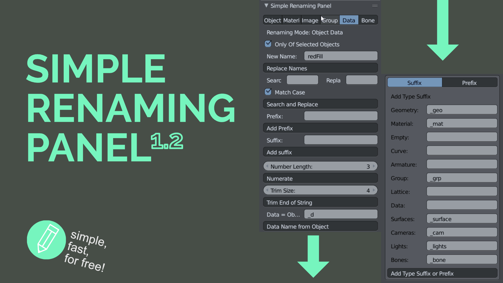

Documentation: https://weisl.github.io/renaming/

<h1>Introduction</h1>

<b> Simple Renaming Panel </b> is a small, but powerful tool to rename more objects at once. The tool includes basic functionalities of adding suffixes, prefixes, search and replace, add suffixes depending on the object type and much more. Over the time more advanced features like a variable system were added. The tool gives a lot of power to you!  
You decide which kind of objects will be affected by the renaming task. Rename all or just selected objects, specify the affected object types like image textures, materials, objects, object data, bones, or collections. This tool can be a real everyday helper. Renaming multiple objects is often needed and keeping the naming conventions can be tedious. The tool provides you with a clear feedback of what has been renamed. This tool is kept simple to be user friendly but offers everything you need to stay organized. 

Join the discussion at [Blender Artists](https://blenderartists.org/t/simple-renaming-panel/676639 "Blender Artists"). You can thank me by leaving a rating at [Gumroad](https://gumroad.com/l/simple_renaming_panel "Gumroad") or sponsor a coffee. 

Documentation: https://weisl.github.io/renaming/

